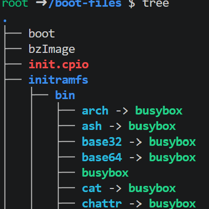
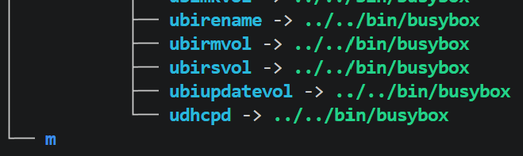
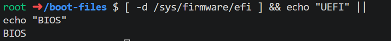
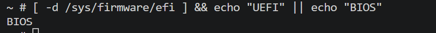
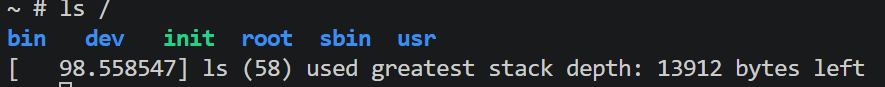
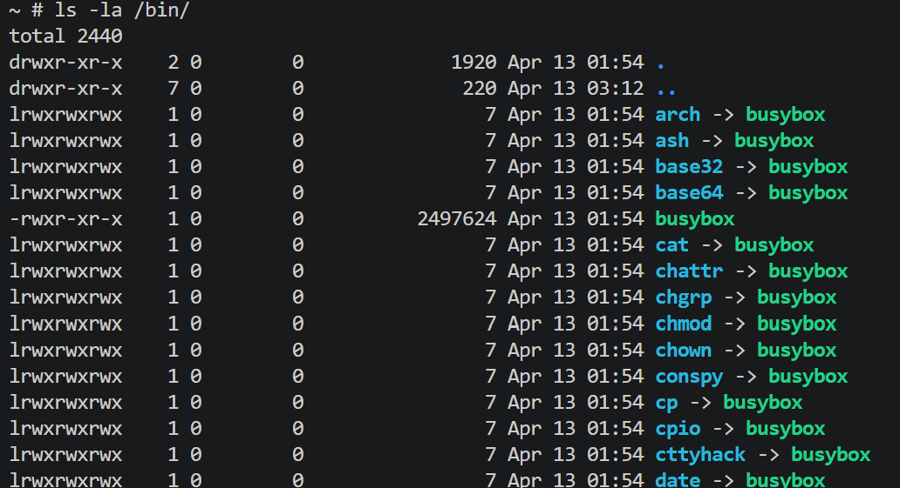
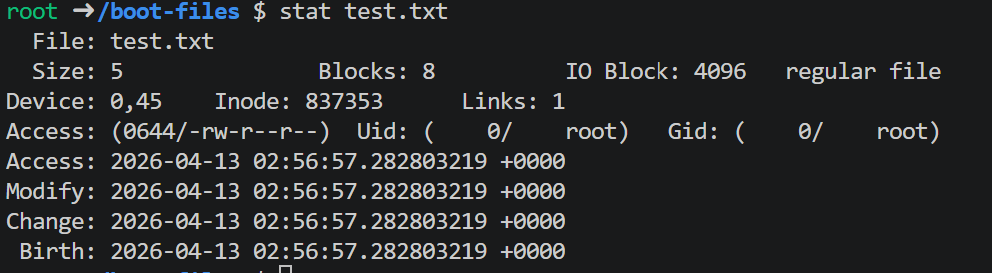
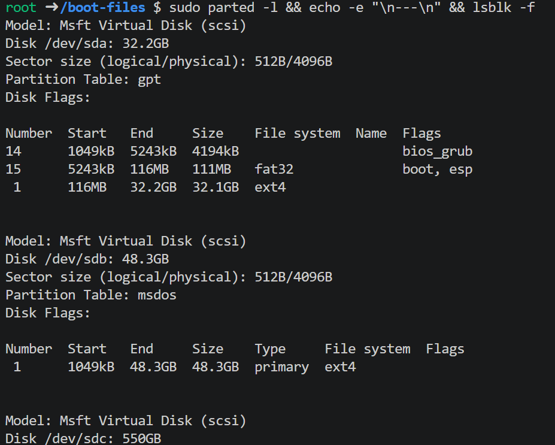

# UNIX-02-SIN-A-Mar-Jul-2026
Repo for intro to UNIX

Proof of kernel panic solution 

Tree of the boot-files directory 

Exercises
1. Firmware type verification
Both in Codespaces and QEMU the result is BIOS. In Codespaces, /sys/firmware/efi does not exist because GitHub Codespaces runs on Linux VMs without EFI exposed. In QEMU the result is also BIOS because QEMU emulates a classic PC with BIOS (i440FX) by default.

2. Inspecting the directory structure inside QEMU
Running ls / inside QEMU showed:
bin   dev   init  root  sbin  usr
Missing directories compared to a standard Linux system: etc, lib, lib64, proc, sys, tmp, var, home, opt, run, mnt, boot. They are absent because this is a minimal distro where the initramfs is the complete system, there are no configuration files (etc), no virtual filesystems mounted (proc, sys), and since BusyBox is compiled as a static binary, no shared libraries (lib) are needed.

3. Exploring BusyBox
Running ls -la /bin/ confirmed that every command (ls, cp, sh, vi, grep, etc.) is a symlink pointing to the same busybox binary of 2.4MB:

The advantage for embedded systems is that a single binary replaces hundreds of individual executables, saving critical storage and RAM. BusyBox detects which name it was called by and executes the corresponding applet internally. This is essential for devices like routers or cameras with very limited resources.
4. Examining blocks
Running stat test.txt on the file created with echo "hola" > test.txt showed:

Real size: 5 bytes (hola + newline character)
Allocated blocks: 8 blocks × 512 bytes = 4096 bytes (4KB)
Yes, there is internal fragmentation, the file contains only 5 bytes but the filesystem allocates a full 4KB block. The remaining 4091 bytes are wasted but reserved. This happens because ext4 allocates space in fixed 4KB blocks regardless of the actual file size.
5. Analyzing partitions
The output revealed three virtual disks (Microsoft Virtual Disk — Codespaces infrastructure):
/dev/sda — GPT, 32.2GB, contains three partitions: a bios_grub partition (4MB), a FAT32 ESP boot partition (111MB), and the main ext4 root partition (32.1GB).
/dev/sdb — MBR (msdos), 48.3GB, single primary ext4 partition, mounted at /tmp.
/dev/sdc — GPT, 550GB, single ext4 partition used for workspace storage.

lsblk -f showed that the main filesystems in use are ext4 for all data partitions, with several loop devices handling Docker and Codespaces internal mounts. Notably, /dev/sda uses GPT (modern standard, supports up to 128 partitions) while /dev/sdb uses MBR (legacy scheme, limited to 4 primary partitions and 2TB). Our custom boot image also uses MBR implicitly, since Syslinux writes directly to the FAT boot sector without a GPT table.